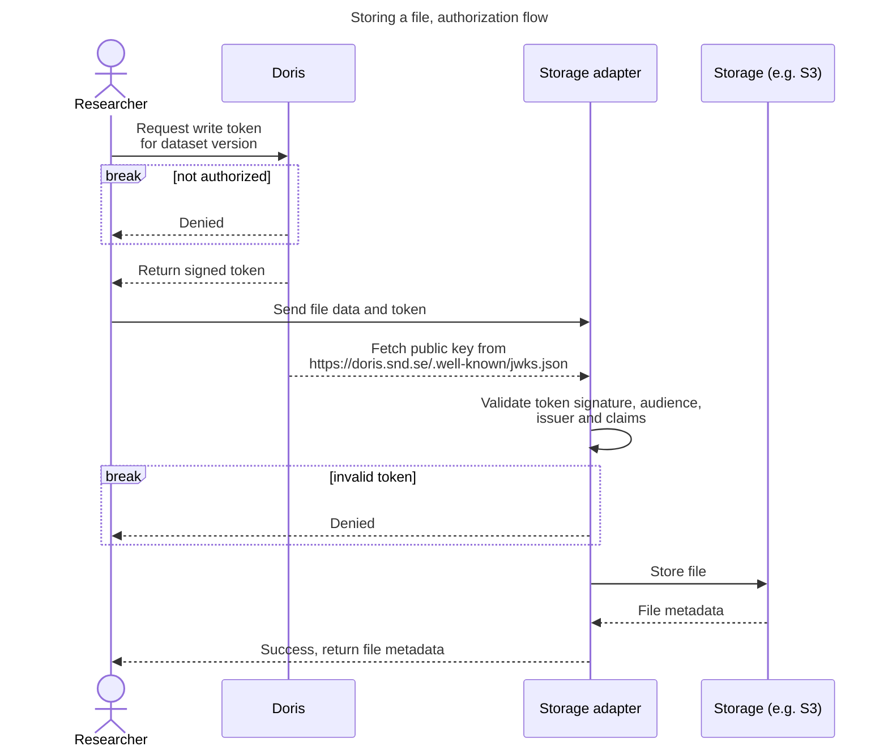
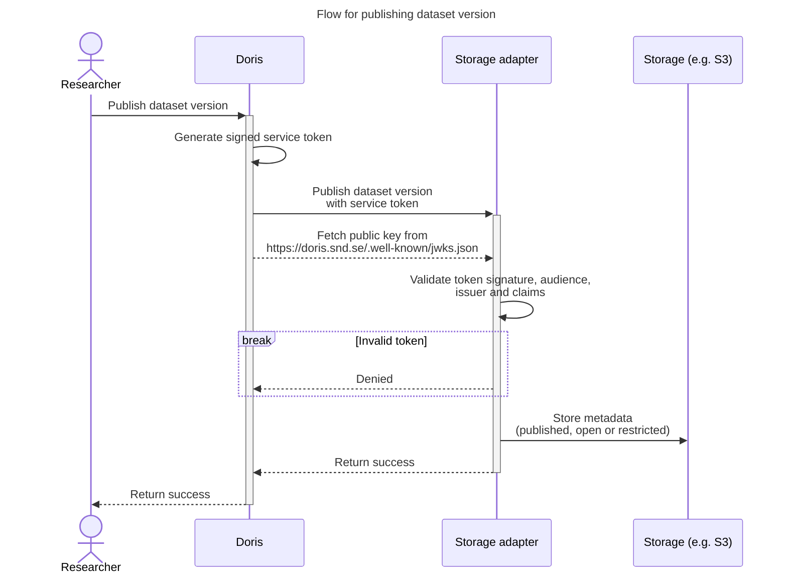
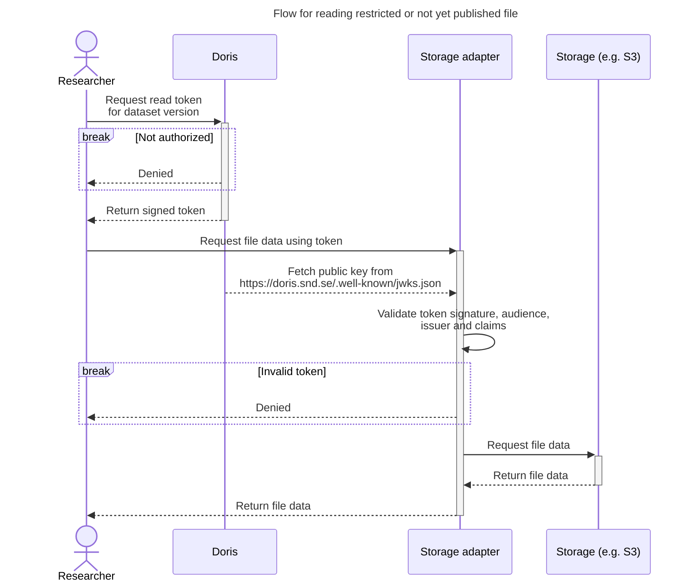

# DORIS Storage Adapter

Documentation to be done.

## Flow diagrams

```mermaid
---
title: Storing a file, authorization flow
---
sequenceDiagram
    actor R as Researcher
    participant D as Doris
    participant SA as Storage adapter
    participant S as Storage (e.g. S3)
    R->>D: Request write token<br/>for dataset version
    break not authorized
        D-->>R: Denied
    end
    D-->>R: Return signed token
    R->>SA: Send file data and token
    D-->>SA: Fetch public key from<br/>https://doris.snd.se/.well-known/jwks.json
    SA->>SA: Validate token signature, audience,<br/>issuer and claims
    break invalid token
        SA-->>R: Denied
    end
    SA->>S: Store file
    S-->>SA: File metadata
    SA-->>R: Success, return file metadata
```

```mermaid
---
title: Flow for publishing dataset version
---
sequenceDiagram
    actor R as Researcher
    participant D as Doris
    participant SA as Storage adapter
    participant S as Storage (e.g. S3)
    R->>+D: Publish dataset version
    D->>D: Generate signed service token
    D->>+SA: Publish dataset version<br/>with service token
    D-->>SA: Fetch public key from<br/>https://doris.snd.se/.well-known/jwks.json
    SA->>SA: Validate token signature, audience,<br/>issuer and claims
    break Invalid token
        SA-->>D: Denied
    end
    SA->>S: Store metadata<br/>(published, open or restricted)
    SA-->>-D: Return success
    D-->>-R: Return success
```

```mermaid
---
title: Flow for reading restricted or not yet published file
---
sequenceDiagram
    actor R as Researcher
    participant D as Doris
    participant SA as Storage adapter
    participant S as Storage (e.g. S3)
    R->>+D: Request read token<br/>for dataset version
    break Not authorized
        D-->>R: Denied
    end
    D-->>-R: Return signed token
    R->>+SA: Request file data using token
    D-->>SA: Fetch public key from<br/>https://doris.snd.se/.well-known/jwks.json
    SA->>SA: Validate token signature, audience,<br/>issuer and claims
    break Invalid token
        SA-->>R: Denied
    end
    SA->>+S: Request file data
    S-->>-SA: Return file data
    SA-->>-R: Return file data
```
